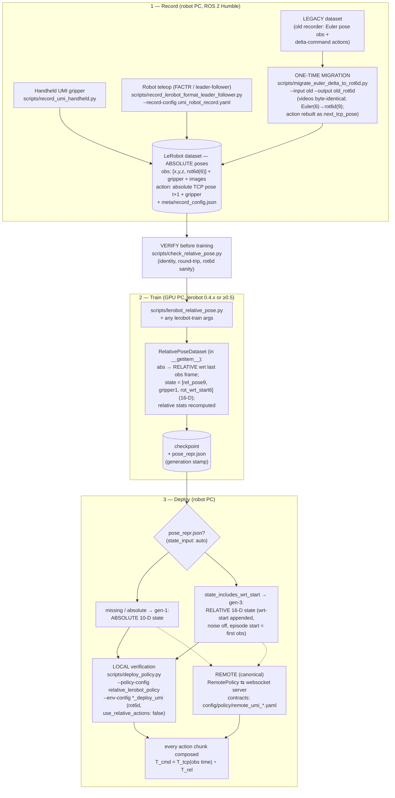

[](https://github.com/astral-sh/ruff)

<a href="https://github.com/utiasDSL/crisp_gym/actions/workflows/ruff_ci.yml"></a>
<a href="https://utiasDSL.github.io/crisp_controllers/"></a>
<a href="https://github.com/utiasDSL/crisp_gym/actions/workflows/pixi_ci.yml"></a>
<a href="https://utiasDSL.github.io/crisp_controllers#citing"></a>


This repository contains Gymnasium environments to train and deploy high-level learning-based policies from [LeRobot](https://github.com/huggingface/lerobot) using [CRISP_PY](https://github.com/utiasDSL/crisp_py) and the [CRISP controllers](https://github.com/utiasDSL/crisp_controllers).

Check the [docs](https://utiasdsl.github.io/crisp_controllers/getting_started/#4-using-the-gym) to get started.

## Documentation

Each document answers one question. Start with the one that matches what you are doing.

| document | answers | typical entry point |
|---|---|---|
| this README | what is this, how do I install it | first time here |
| **[USAGE.md](USAGE.md)** | *how do I do X?* — ordered recipes: record → align/merge datasets → train → deploy → diagnose | the day-to-day reference |
| [crisp_gym/scripts/README.md](crisp_gym/scripts/README.md) | *what does this script or flag do?* — training and deployment script reference | you know the step, you need the flags |
| [REMOTE_INFERENCE.md](REMOTE_INFERENCE.md) | the websocket contract and wire protocol for serving a policy from the GPU machine | building or debugging the server |
| [HANDOFF.md](HANDOFF.md) | *what must I not break?* — pose/data conventions, invariants, verification procedure | before changing pose math, recording, or the data schema |
| [CHANGELOG.md](CHANGELOG.md) | released versions | — |

The UMI-style data pipeline — handheld and robot recording, dataset alignment
and merging, relative-pose training, deployment — is covered end to end in
[USAGE.md](USAGE.md).

## Workspace layout

Clone `crisp_gym` and its sibling repositories into a common workspace folder
(e.g. `~/workspace`) — several paths assume the repos sit **next to each
other**:

```
workspace/
├── crisp_controllers_demos/   # robot bring-up (Docker); mounts ../crisp_py into its containers
├── crisp_gym/                 # this repository
├── crisp_py/                  # robot/gripper Python client
└── lerobot/                   # created by crisp_gym/scripts/setup_lerobot.sh (../lerobot)
```

```bash
mkdir -p ~/workspace && cd ~/workspace
git clone https://github.com/utiasDSL/crisp_controllers_demos.git
git clone https://github.com/utiasDSL/crisp_gym.git
git clone https://github.com/utiasDSL/crisp_py.git
```

Concretely, the sibling layout matters because:

- `pixi.toml` installs LeRobot editable from `../lerobot` (cloned by
  `scripts/setup_lerobot.sh` — see Installation below),
- `pixi.toml` installs `crisp_py` editable from `../crisp_py` (the local
  checkout satisfies the `crisp_python` requirement instead of the lagging
  PyPI wheel),
- `crisp_controllers_demos/docker-compose.yaml` bind-mounts `../crisp_py`
  into the robot containers.

## Installation

The environments run inside a [pixi](https://pixi.sh) workspace. The
`humble-lerobot` environment (ROS 2 Humble + LeRobot) needs a **local LeRobot
clone next to this repo** — it is installed editable from `../lerobot`, so a
sibling of `crisp_gym` (e.g. `/workspace/lerobot` alongside `/workspace/crisp_gym`).

**Set up LeRobot first, then install the environment:**

```bash
cd /workspace/crisp_gym              # the crisp_gym repo root
bash scripts/setup_lerobot.sh        # clones LeRobot v0.6.1 to ../lerobot
rm -f pixi.lock
pixi install -e humble-lerobot
```

`scripts/setup_lerobot.sh` clones **v0.6.1**, which is what `pixi.toml`'s
`humble-lerobot` environment expects (Python 3.12 + numpy 2). At that version
**no patching is needed**: LeRobot's own `opencv-python-headless` bound (<4.14)
accepts the conda-provided opencv, and `pixi.toml` pins numpy and packaging to
LeRobot's own ranges. If you already cloned LeRobot yourself the script detects
it, skips the clone, and warns when the checkout is a different revision.

Clone a different revision with `LEROBOT_REV=v0.4.4 bash scripts/setup_lerobot.sh`
— but note 0.4.x has **no `dataset` extra** (added in 0.6.x), so `pixi.toml`'s
`extras = ["dataset"]` will not resolve against it and must be pinned back at the
same time.

> **Do not set `LEROBOT_PATCH_NUMPY1=1` on this environment.** Those patches
> relax the clone's `requires-python` to 3.11, `numpy` to >=1.26 and drop
> `rerun-sdk`; they are correct only when the pixi env is itself on Python 3.11
> + numpy 1.26. Applied to the current numpy-2 environment they silently undo
> the requirements it was migrated to. They are opt-in for exactly that reason.

## Data pipeline: record → train → deploy



Notes:

- **Never store relative poses on disk** — datasets hold ABSOLUTE poses; the
  relative conversion happens inside the training wrapper and (mirrored) at
  inference. Details/invariants: [HANDOFF.md](HANDOFF.md) §1.
- **Migrated legacy data caveat (gripper units):** the old recorder stored the
  device-normalized gripper value, not the UMI reference-width scale. Don't
  mix migrated and UMI-recorded datasets in one training, and when deploying a
  model trained on migrated data set `reference_width: == device_max_width`
  in `config/policy/relative_lerobot_policy.yaml` so the unit conversion is
  identity.
- **Merging datasets recorded on different rigs** (two arms, different codecs,
  different extra states) needs the schemas, the video codecs and the
  statistics reconciled first — `aggregate_datasets` applies four separate
  compatibility gates and two of them fail only at the very end of the merge.
  Step-by-step, with a table of what blocks a merge and what fixes it:
  [USAGE.md §6](USAGE.md#6-post-process-align-and-merge-datasets).
- Full step-by-step commands: [USAGE.md](USAGE.md).

## Training GR00T N1.7

GR00T is trained through a launcher rather than `lerobot-train` directly,
because three of lerobot's GR00T defaults are wrong for a rot6d pose dataset and
each one fails **silently** — `use_relative_actions=false` decodes relative
actions against absolute statistics, `relative_exclude_joints=[]` trains the
gripper as a delta, and `push_to_hub=true` aborts a local run after the dataset
has loaded. `scripts/train_groot.sh` pins all three, and gates on the dataset
and on Hugging Face access before it starts, so a bad run costs seconds instead
of GPU-hours:

```bash
export HF_TOKEN=hf_...                                # 0. the backbone repo is GATED
bash scripts/check_gpu_groot.sh                       # 1. is this machine ready?
python crisp_gym/scripts/groot_preflight.py \
    datasets/franka_electricbox/lerobot               # 2. is the dataset fit?
bash scripts/train_groot.sh \
    --dataset datasets/franka_electricbox/lerobot \
    --output  outputs/train/groot_electricbox         # 3. train (runs 2 itself)
bash scripts/check_trained_groot.sh \
    outputs/train/groot_electricbox                   # 4. did the flags survive?
```

Datasets live at `datasets/<name>/lerobot` — the directory holding `meta/` and
`data/` — and runs at `outputs/train/<run>`, as everywhere else in this repo.
`--dataset` is absolutised by the launcher, so a relative path is safe;
`--output` is passed through verbatim, so it is relative to wherever you run
the command from.

There are **two launchers**, with the same gates and the same pinned flags:

```bash
bash scripts/train_groot.sh --dataset DIR --output DIR [--se3]   # flags
SE3=1 ./train_groot_server.sh                                    # environment
```

`train_groot_server.sh` defaults every path off its own directory — datasets at
`$WORKDIR/datasets/<name>`, runs at `$WORKDIR/output/train/`, and the
Hugging Face cache at `$WORKDIR/.home` so the ~10 GB download survives a
container restart — which is what you want on a training box with a bind mount.
Its cross-embodiment mode is `SE3=1` (add `WRT_START=0` for a 10-D state)
rather than `--se3`. **The two forms are not interchangeable**: each script
ignores the other's, silently, so `SE3=1` on the flag script trains the wrong
mode without complaining.

- **Feed it the ABSOLUTE dataset.** GR00T builds its own relative actions from
  absolute ones, so a `lerobot_relative_pose.py` output makes it learn deltas of
  deltas — the launcher refuses one. For a fine-tune that conversion is
  componentwise subtraction, not SE(3): the synthesized `new_embodiment` action
  config is hardcoded `NON_EEF`/`DEFAULT`.
- **`--se3` / `SE3=1` is the cross-embodiment mode.** GR00T never relativizes the
  *observation* — in lerobot and Isaac-GR00T alike the state is only ever a
  reference — and an absolute TCP pose lives in the robot's own base frame, so
  the same motion is different numbers on a Franka and a UR. It routes
  training through the UMI wrapper, which does relativize it, and switches
  GR00T's own action conversion off so nothing is converted twice.
- **The backbone repo is gated.** GR00T pulls `nvidia/GR00T-N1.7-3B` *and*
  `nvidia/Cosmos-Reason2-2B`; only the second is gated. Accept its terms and
  export `HF_TOKEN` — `HF_TOKEN` beats `HF_HOME`, which matters because a
  `huggingface-cli login` done under your real `HOME` is invisible once
  `HF_HOME` points into a bind mount.
- **Neither launcher is self-contained.** Both resolve `groot_preflight.py`
  and, for cross-embodiment mode, `lerobot_relative_pose.py` by path — at
  `../crisp_gym/scripts/*` for `train_groot.sh`, at
  `$WORKDIR/crisp_gym/crisp_gym/scripts/*` (a clone) for
  `train_groot_server.sh`. Copy or clone them accordingly, or the preflight
  gate fails claiming the *dataset* is at fault.
- **Deploying one** needs `pixi.toml`'s `lerobot` extras to include `groot`.
  Without it the policy imports and the checkpoint loads, but `dm-tree` is
  demanded inside `prepare_input` — so the rollout dies on its first frame,
  after the robot has homed.

Every flag, both modes, the artefacts a run leaves behind, and the three
checkers:
[crisp_gym/scripts/README.md](crisp_gym/scripts/README.md#scriptstrain_grootsh--gr00t-n17-fine-tuning-launcher).

## Deploying a trained policy

Models trained with `scripts/lerobot_relative_pose.py` output UMI-style
RELATIVE poses that must be composed with the TCP pose captured at observation
time. Two paths:

- **Remote (canonical)** — inference on the GPU machine over websocket, the
  robot machine stays torch-free. Contract and wire protocol:
  [REMOTE_INFERENCE.md](REMOTE_INFERENCE.md).
- **Local** — in-process on the robot machine, for verification and only for
  checkpoints trained against that machine's own lerobot:

  ```bash
  python -m crisp_gym.scripts.deploy_policy \
      --env-config ur7e_robotiq_deploy_umi \
      --policy-config relative_lerobot_policy \
      --path outputs/train/<run>/checkpoints/last/pretrained_model \
      --repo-id my_org/deploy_eval --fps 15
  ```

Gripper widths, camera topics and the `rotation_6d` / `use_relative_actions`
requirements of the deploy env are prerequisites, not defaults — and a
checkpoint carries a *generation* that decides what `observation.state` it
expects. Both are in [USAGE.md §9](USAGE.md#9-deploy-a-trained-policy); every
flag and policy config is in
[crisp_gym/scripts/README.md](crisp_gym/scripts/README.md#deployment).

Check the [docs](https://utiasdsl.github.io/crisp_controllers/getting_started/#4-using-the-gym) to get started.
